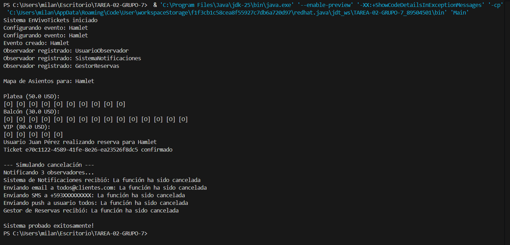

# EnVivoTickets
EnVivoTickets es un sistema desarrollado en Java para la gestión de eventos culturales y de entretenimiento, incluyendo conciertos, obras de teatro, microteatro y stand-up comedy. El proyecto aplica de forma práctica los principios de la programación orientada a objetos y el uso correcto de patrones de diseño, con el objetivo de construir una solución modular, extensible y mantenible.

La creación de eventos se realiza mediante el patrón Factory Method, permitiendo instanciar y configurar distintos tipos de eventos sin acoplar el código cliente a implementaciones concretas. La gestión de funciones y notificaciones ante cambios de estado se maneja con el patrón Observer, mientras que la organización y visualización de asientos se implementa mediante una estructura Composite, simulando un sistema real de reserva de entradas.

Adicionalmente, el sistema incluye la gestión de tickets con control de estados y expiración de reservas.

El proyecto incorpora pruebas unitarias con JUnit enfocadas en los componentes de mayor impacto, validando la correcta aplicación de los patrones de diseño y el comportamiento esperado del sistema.

Este repositorio corresponde al proyecto final académico y tiene como finalidad demostrar el dominio de diseño orientado a objetos, patrones de diseño y buenas prácticas de desarrollo en Java.

## ▶️ Ejecución del sistema

La siguiente imagen muestra la ejecución del sistema EnVivoTickets desde consola, evidenciando la creación de eventos, registro de observadores, visualización del mapa de asientos, confirmación de tickets y notificación ante la cancelación de una función.

